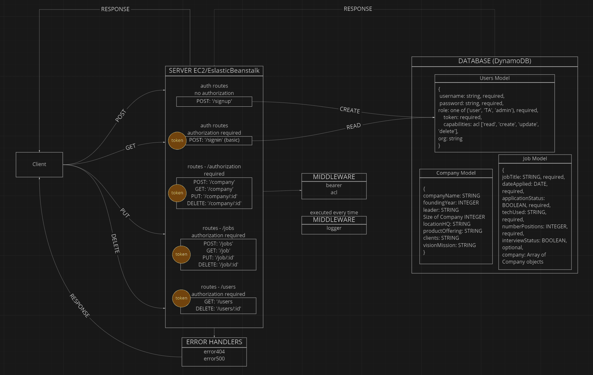

# Knect.dev

<div id="top"></div>
<!--
*** Thanks for checking out the Best-README-Template. If you have a suggestion
*** that would make this better, please fork the repo and create a pull request
*** or simply open an issue with the tag "enhancement".
*** Don't forget to give the project a star!
*** Thanks again! Now go create something AMAZING! :D
-->


<!-- PROJECT SHIELDS -->
<!--
*** I'm using markdown "reference style" links for readability.
*** Reference links are enclosed in brackets [ ] instead of parentheses ( ).
*** See the bottom of this document for the declaration of the reference variables
*** for contributors-url, forks-url, etc. This is an optional, concise syntax you may use.
*** https://www.markdownguide.org/basic-syntax/#reference-style-links
-->
[![Contributors][contributors-shield]][contributors-url]
[![Forks][forks-shield]][forks-url]
[![Stargazers][stars-shield]][stars-url]
[![Issues][issues-shield]][issues-url]
[![MIT License][license-shield]][license-url]
<!-- [![LinkedIn][linkedin-shield]][linkedin-url] -->


<!-- PROJECT LOGO -->
<br />
<div align="center">
  <a href="https://github.com/Knect-Dev/Knect-Dev-Backend">
    
  </a>

<h3 align="center">Knect.Dev</h3>

  <p align="center">
    Knect.Dev description
    <br />
    <a href="https://github.com/Knect-Dev/Knect-Dev-Backend"><strong>Explore the docs »</strong></a>
    <br />
    <br />
    <a href="https://github.com/Knect-Dev/Knect-Dev-Backend">View Demo</a>
    ·
    <a href="https://github.com/Knect-Dev/Knect-Dev-Backend/issues">Report Bug</a>
    ·
    <a href="https://github.com/Knect-Dev/Knect-Dev-Backend/issues">Request Feature</a>
  </p>
</div>


<!-- TABLE OF CONTENTS -->
<details>
  <summary>Table of Contents</summary>
  <ol>
    <li>
      <a href="#about-the-project">About The Project</a>
      <ul>
        <li><a href="#built-with">Built With</a></li>
      </ul>
    </li>
    <li>
      <a href="#getting-started">Getting Started</a>
      <ul>
        <li><a href="#prerequisites">Prerequisites</a></li>
        <li><a href="#installation">Installation</a></li>
      </ul>
    </li>
    <li><a href="#usage">Usage</a></li>
    <li><a href="#roadmap">Roadmap</a></li>
    <li><a href="#contributing">Contributing</a></li>
    <li><a href="#license">License</a></li>
    <li><a href="#contact">Contact</a></li>
    <li><a href="#acknowledgments">Acknowledgments</a></li>
  </ol>
</details>


<!-- ABOUT THE PROJECT -->
## About The Project

[Delpoyed Page](https://knect-dev.herokuapp.com/)
<!-- [![Product Name Screen Shot][product-screenshot]](https://example.com) -->

This project currently implements phase one (backend) of a two phase project (full web application deployment).

The Goal of this project is to create a Targeted Companies & High-Volume Tracking List that allows those seeking jobs to effectively document the jobs they have applied for as well as thier most up to date interactions. Phase one, the backend of this project, focuses on building and deploying a reliable backend with robust schemas and database models. Phase two, the frontend portion, will focus on building a user-friendly interface in React to streamline data input as well as visualize metrics in real time of your job search.

<p align="right">(<a href="#top">back to top</a>)</p>


### Built With

* [JavaScript](https://www.javascript.com/)
* [node.js](https://nodejs.org/en/)
* [jest](https://jestjs.io/docs/getting-started)
* [aws-sdk](https://aws.amazon.com/sdk-for-javascript/)
* [base-64](https://www.base64decode.org/)
* [bcrypt](https://www.npmjs.com/package/bcrypt)
* [dotenv](https://github.com/motdotla/dotenv)
* [dynamoose](https://dynamoosejs.com/getting_started/Introduction)
* [express](https://expressjs.com/)
* [jsonwebtoken](https://github.com/auth0/node-jsonwebtoken)
* [nanoid](https://github.com/ai/nanoid)

<p align="right">(<a href="#top">back to top</a>)</p>


<!-- GETTING STARTED -->
## Getting Started

To get a local copy up and running follow these simple example steps.

### Prerequisites

This project uses npm node package manager to install the required modules.

### Installation

1. Get a free API Key at [https://example.com](https://example.com)
2. Clone the repo
   ```sh
   git clone https://github.com/Knect-Dev/Knect-Dev-Backend.git
   ```
3. Install NPM packages
   ```sh
   npm install i
   ```
4. Enter your API in `config.js`
   ```js
   const API_KEY = 'ENTER YOUR API';
   ```

<p align="right">(<a href="#top">back to top</a>)</p>


<!-- USAGE EXAMPLES -->
## Usage

Use this space to show useful examples of how a project can be used. 

Comming soon with Front End Deployment.

<!-- _For more examples, please refer to the [Documentation](https://example.com)_ -->

<p align="right">(<a href="#top">back to top</a>)</p>


## Data Models
This project utilized dynamoose and DynamoDB and the following data models...

### Users
``` Javascript
'Users' {
  'id': String, required,
  'firstName': String, required,
  'lastName': String, required,
  'password': String, required,
  'token': String, required,
  'email': String, required,
  'role': String, default: 'user',
  'approvedViewer': Array of [Strings],
  'Jobs': Array of [Strings],
}
```
### Jobs
``` Javascript
'Jobs' {
  'id': String, required,
  'company': String, required,
  'title': String, required,
  'location': String,
  'appliedDate': Date,
  'applied': Boolean,
  'technologies': Array of [Strings],
  'openPositions': Number,
  'interview': Boolean,
  'contacts': String,
  'notes': String,
  'owner': String, required,
}
```

### Companies
``` Javascript
'Companies' {
  'id': String, required,
  'name': String, required,
  'leader': String,
  'size': String,
  'hqLocation': String,
  'product': String,
  'clients': String,
  'mission': String,
  'careersPage': String,
}
```

<p align="right">(<a href="#top">back to top</a>)</p>

## Routes

### Users
- GET
- GET (all)
- 

### Jobs

### Companies

<p align="right">(<a href="#top">back to top</a>)</p>

<!-- ROADMAP -->
## Roadmap

-  Full CRUD Users w/bearer authentication
-  Full CRUD Jobs
-  Full CRUD Companies


See the [open issues](https://github.com/Knect-Dev/Knect-Dev-Backend/issues) for a full list of proposed features (and known issues).

<p align="right">(<a href="#top">back to top</a>)</p>


## UML



<!-- CONTRIBUTING -->
## Contributing

Contributions are what make the open source community such an amazing place to learn, inspire, and create. Any contributions you make are **greatly appreciated**.

If you have a suggestion that would make this better, please fork the repo and create a pull request. You can also simply open an issue with the tag "enhancement".
Don't forget to give the project a star! Thanks again!

1. Fork the Project
2. Create your Feature Branch (`git checkout -b feature/AmazingFeature`)
3. Commit your Changes (`git commit -m 'Add some AmazingFeature'`)
4. Push to the Branch (`git push origin feature/AmazingFeature`)
5. Open a Pull Request

<p align="right">(<a href="#top">back to top</a>)</p>


<!-- LICENSE -->
## License

Distributed under the MIT License. See [`LICENSE`](/LICENSE) for more information.

<p align="right">(<a href="#top">back to top</a>)</p>


<!-- CONTACT -->
## Contact

Spencer Tower - [Github](https://github.com/SpencerTower) - [Linkedin](https://linkedin.com/in/spencertower/)

Kellen Linse - [Github](https://github.com/Kellen-Linse) - [Linkedin](https://www.linkedin.com/in/kellen-linse/)

Matt Miguel - [Github](https://github.com/jamiguel23) - [Linkedin](https://www.linkedin.com/in/jamiguel23/)

Erik Savage - [Github](https://github.com/eriksavage) - [Linkedin](linkedin.com/in/erikksavage)

Chris Harden - [Github](https://github.com/HardenChris) - [LinkedIn](linkedin.com/in/hardenchristopher00)

Project Link: [https://github.com/Knect-Dev/Knect-Dev-Backend](https://github.com/Knect-Dev/Knect-Dev-Backend)

<p align="right">(<a href="#top">back to top</a>)</p>


<!-- ACKNOWLEDGMENTS -->
## Acknowledgments

* Jacob Knaack
* The Squad
* Harambe


<p align="right">(<a href="#top">back to top</a>)</p>

## Resources

- [Choosing the Right DynamoDB Partition Key](https://aws.amazon.com/blogs/database/choosing-the-right-dynamodb-partition-key/)
- [Dynamoose Getting Started](https://dynamoosejs.com/getting_started/Introduction)
- [DynamoDB Docs](https://docs.aws.amazon.com/AWSJavaScriptSDK/latest/AWS/DynamoDB.html)
- [Object references and copying](https://javascript.info/object-copy)


<!-- MARKDOWN LINKS & IMAGES -->
<!-- https://www.markdownguide.org/basic-syntax/#reference-style-links -->
[contributors-shield]: https://img.shields.io/github/contributors/Knect-Dev/Knect-Dev-Backend.svg?style=for-the-badge
[contributors-url]: https://github.com/Knect-Dev/Knect-Dev-Backend/graphs/contributors
[forks-shield]: https://img.shields.io/github/forks/Knect-Dev/Knect-Dev-Backend.svg?style=for-the-badge
[forks-url]: https://github.com/Knect-Dev/Knect-Dev-Backend/network/members
[stars-shield]: https://img.shields.io/github/stars/Knect-Dev/Knect-Dev-Backend.svg?style=for-the-badge
[stars-url]: https://github.com/Knect-Dev/Knect-Dev-Backend/stargazers
[issues-shield]: https://img.shields.io/github/issues/Knect-Dev/Knect-Dev-Backend.svg?style=for-the-badge
[issues-url]: https://github.com/Knect-Dev/Knect-Dev-Backend/issues
[license-shield]: https://img.shields.io/github/license/Knect-Dev/Knect-Dev-Backend.svg?style=for-the-badge
[license-url]: https://github.com/Knect-Dev/Knect-Dev-Backend/blob/master/LICENSE.txt
[linkedin-shield]: https://img.shields.io/badge/-LinkedIn-black.svg?style=for-the-badge&logo=linkedin&colorB=555
[linkedin-url]: https://linkedin.com/in/linkedin_username
[product-screenshot]: images/screenshot.png
